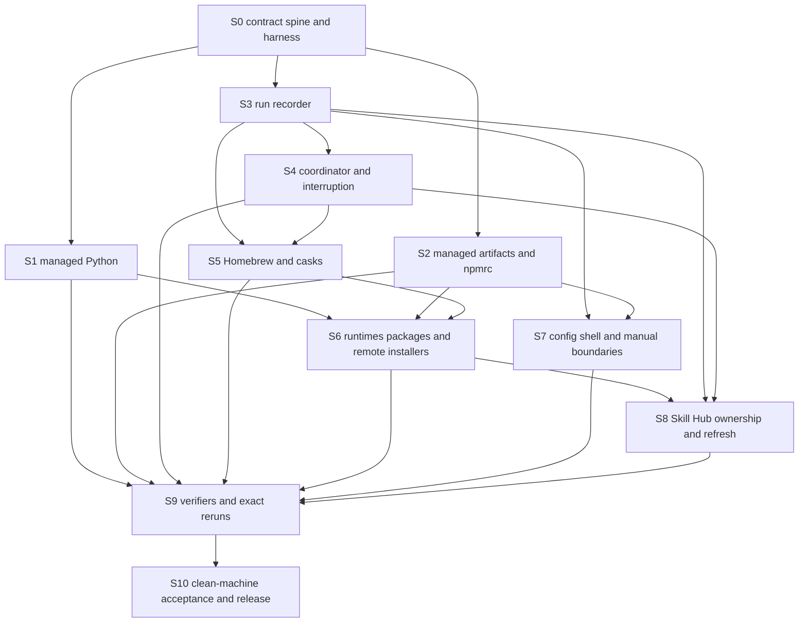

# Bootstrap Resilience Implementation Plan

Status: resolution artifact for
[Synthesize the bootstrap resilience implementation plan](https://github.com/ironicbuddha/dev-env-export/issues/31),
captured 2026-07-28.

## Decision

Implement the bootstrap improvements as ten dependency-gated tracer-bullet
slices. Start by fixing the shared state, outcome, failure, and event
vocabulary at an executable test seam. Then deepen three independent module
families:

- owner-aware state adapters;
- recovery-safe managed artifacts;
- the run recorder and coordinator.

Do not add broad retries, hard stall termination, or resume-by-skipping before
the affected adapter can inspect and verify post-failure state. The first
behavioral slice is the reproduced valid-existing-`uv` failure shared by both
Bootstrap Profiles. The second user-state slice is the duplicated `.npmrc`
rewrite. These provide narrow proofs before Homebrew, cask, runtime, remote
source, configuration, and Skill Hub behavior is migrated.

The plan finishes only when both exact Bootstrap Profile sequences pass
hermetic first-plus-immediate-second-run tests and separate clean Apple Silicon
ZIP-first acceptance runs. Local fixtures remain regression evidence and do
not replace those release gates.

## Inputs and Settled Decisions

This plan reconciles rather than reopens:

- the
  [contract and failure-mode inventory](../audits/bootstrap-contract-inventory.md);
- the
  [testing and verification-seam review](../audits/bootstrap-testing-gap-review.md);
- the
  [logging and diagnostic review](../audits/bootstrap-logging-diagnostic-review.md);
- the
  [resilience and recovery review](../audits/bootstrap-resilience-recovery-review.md);
- the
  [idempotency and repeat-run review](../audits/bootstrap-idempotency-repeat-run-review.md).

The following decisions are fixed inputs:

- bootstrap recovery is forward-only; there is no package-manager or
  cross-file rollback;
- an immediate unchanged rerun executes the same complete profile sequence and
  makes no semantic mutation;
- repair authority requires ownership evidence; familiar names and paths do
  not establish ownership;
- ordinary runs do not implicitly refresh Homebrew metadata, packages, remote
  installers, or Skill Hub sources;
- only proven run-owned staging may be deleted automatically;
- recovery-safe configuration writes retain immutable backups and never prune
  them automatically;
- required failures stop the run, while explicitly optional failures remain
  visible as degraded outcomes;
- authentication, credentials, cloud profiles, Git identity, master
  environment files, 1Password item contents, and first-launch state remain
  manual and outside automated convergence;
- resume-by-skipping remains out of scope until every skipped step and
  dependency has a proven state probe.

## Shared Contract Spine

The first slice must publish one shell-safe vocabulary consumed by production
modules, fixtures, run artifacts, and acceptance reports. Do not let individual
steps invent synonyms.

| Dimension | Closed vocabulary |
| --- | --- |
| Inspected state | `absent`, `valid_exact`, `valid_compatible`, `managed_version_drift`, `managed_invalid`, `foreign_conflict`, `unknown`, `interrupted` |
| Successful or non-failing disposition | `changed`, `satisfied`, `satisfied_compatible`, `optional_skipped`, `optional_degraded` |
| Failing disposition | `manual_action`, `required_failure`, `interrupted`, `logging_failure` |
| Failure class | `transient_external`, `manual_action`, `local_precondition`, `managed_state_invalid`, `foreign_state_conflict`, `integrity_failure`, `interrupted`, `concurrent_run`, `internal_failure`, `optional_degraded` |
| Package requirement | `present`, `range`, `exact` |
| Gating level | `required`, `optional` |
| Recovery | `retry_operation`, `retry_profile`, `manual_then_retry`, `resolve_conflict`, `do_not_retry`, `none` |

Stable, narrower codes such as `network_reset`,
`uv_environment_invalid`, or `skill_hub_wrong_origin` refine a failure class.
Vendor output and raw exit status remain evidence; neither is the contract.

Every operation event must be able to carry:

- schema version, globally unique run id, source identity, Bootstrap Profile,
  and privacy class;
- step, operation, non-secret target identifier, position, and gating level;
- state before and after, disposition, failure class, stable code, raw status,
  and elapsed time;
- attempt and maximum attempts;
- safe recovery action and relative raw-log reference.

The event interface must run in stock macOS Bash before Homebrew, Python, Node,
or `jq` exists.

## Target Module Boundaries

Keep external interfaces intent-level and move complexity behind them.

| Module | Small external interface | Internal responsibility |
| --- | --- | --- |
| Contract vocabulary | Validate or render a known state, disposition, failure class, policy, or recovery action. | Closed values, schema version, compatibility checks, and test diagnostics. |
| Run recorder | Begin/end run, step, and operation; emit classified event; set guidance. | Structured append-only events, raw capture, atomic current state, summaries, warning aggregation, source identity, privacy labels, and sanitized export. |
| Run coordinator | Execute one profile and one current child operation. | Per-user mutation lock, child process group, signal forwarding, durable cursor, incomplete-run recognition, and finalization ordering. |
| Operation policy | Execute one named policy around an adapter-owned command. | Attempt timing, bounded backoff, connection/progress deadlines, heartbeats, and policy events. It never decides whether state is safe to mutate. |
| State-aware adapter | Ensure one formula, cask, runtime, package, managed environment, checkout, or projection. | Inspect, act, verify, and recover for one vendor/state family; ownership and post-failure classification. |
| Managed-artifact adapter | Install exact content, merge one overlay, replace one managed block, or apply one versioned migration. | Target-type refusal, co-managed regions, same-filesystem staging, validation, unique backup, atomic promotion, post-verification, and owned cleanup. |
| Fresh-process test harness | Run one production entrypoint in isolated state with selected adapters. | Isolated `HOME`/`PATH`, stateful fake commands, call/event logs, fault injection, before/after snapshots, and evidence-class reporting. |

Do not build a generic state machine that knows Homebrew, npm, `uv`, Git, and
user-file semantics. Each adapter owns its vendor rules. Likewise, do not add a
repo-wide `retry "$@"`; each operation selects a named policy only after its
adapter proves retry safety.

## Delivery Slices

Each slice must finish green and independently reviewable. A local red test may
start a slice, but an intentionally red commit must not land on `main`.

### S0 — Contract spine, stateful harness, and hosted gate

Purpose: fix the vocabulary and the executable seam before behavior diverges
across modules.

Primary impact:

- add a stock-Bash contract module under `scripts/lib/`;
- add a fresh-process harness and reusable stateful command adapters under
  `tests/lib/` and `tests/fakes/`;
- expand the master-runner contract to assert the exact ordered steps,
  exclusions, aliases, and forwarded profile arguments for both profiles;
- add a hosted Apple Silicon-compatible macOS workflow that runs
  `/bin/bash tests/run.sh` without network or real-home access.

Acceptance:

1. Unknown contract values fail as `internal_failure`; known values round-trip
   without prose parsing.
2. Every test case runs in a fresh process with an isolated home, adapter state,
   and append-only call log.
3. `carlo-baseline`, `carlo`, `shared-baseline`, and `shared` resolve to the
   exact intended sequences; missing/invalid profiles start no child.
4. Existing tests remain green locally and in hosted macOS CI.
5. Test output labels source-policy, helper, step, orchestrator, and machine
   acceptance evidence separately.

### S1 — Managed Python environment tracer bullet

Purpose: make the proven step-04 repeat failure red, then make it green through
the intended state-adapter seam.

Primary impact:

- add a managed-Python environment adapter under `scripts/lib/`;
- route `scripts/04-install-pip-packages.sh` through it for both profiles;
- replace the stateless fake `uv` with a stateful adapter;
- add a focused real-`uv` regression at the production command-line seam.

Required behavior:

- absence creates and validates an ownership-marked environment;
- `valid_exact` and `valid_compatible` reuse the environment without invoking
  `uv venv`;
- package work installs only missing or out-of-policy declarations and verifies
  afterward;
- wrong-interpreter, partial, or corrupt state may be quarantined only when an
  ownership manifest proves bootstrap ownership;
- an unmarked environment, symlink, non-directory, or unknown target is
  preserved as a conflict with a precise manual path;
- no path invokes `uv venv --clear`;
- package-install failure retains the environment, reinspects it, and reports
  installed, missing, and uncertain work for a forward rerun.

Acceptance matrix:

- absent, valid existing, immediate second run, missing package, version drift,
  wrong interpreter, partial, corrupt, foreign, symlink, permission failure,
  interrupted staging, and package failure;
- the unchanged second invocation makes no create call, backup, staging, or
  package mutation;
- the focused real-`uv` reproduction passes against a valid existing
  environment.

### S2 — Managed-artifact module and `.npmrc` tracer bullet

Purpose: establish one recovery-safe co-managed write before migrating all
configuration paths.

Primary impact:

- deepen the existing file-safety and managed-shell helpers into one
  managed-artifact module;
- add one nvm-compatible npm-configuration adapter;
- remove both copies of `strip_npmrc_conflicts` from steps 02 and 03 and call
  the adapter once at the canonical pre-nvm seam.

Required behavior:

- exact-file, overlay-merge, managed-block, and versioned-migration operations
  share target refusal, same-filesystem staging, validation, unique immutable
  backup, atomic promotion, post-verification, and run-owned cleanup;
- backup identity includes the globally unique run id plus a mutation sequence
  or target digest;
- `.npmrc` owns only active `prefix` and `globalconfig` assignments and
  preserves comments, whitespace, ordering, registry configuration,
  credentials, tokens, and every unrelated line;
- symlink and non-regular `.npmrc` targets are not read through, replaced, or
  logged;
- an unchanged second call creates no backup and does not rewrite the file.

Acceptance matrix:

- absent, exact, user-modified, malformed, symlink, non-file, same-second
  backup collision, pre-promotion interruption, post-promotion verification
  failure, and immediate repeat;
- injected pre-promotion failure leaves the original byte-identical;
- no diagnostic contains `.npmrc` contents or secret-bearing values.

### S3 — Structured run recorder

Purpose: make recovery state durable and useful before adding retries.

Primary impact:

- deepen the recorder in `scripts/00-bootstrap.sh` into a dedicated stock-Bash
  module;
- retain unique private run directories, transcript, step logs, environment
  evidence, status ledger, and summary;
- add an append-only structured event file, atomic current-state record,
  portable relative artifact references, and stable latest-run discovery;
- centralize profile-aware completion and recovery guidance;
- add an explicit deterministic shareable-bundle command.

Required behavior:

- current state is atomically written at run, step, and operation start/end;
- source identity works for Git and ZIP entry paths;
- final output names failed step/operation, class/code, raw status,
  completed/remaining/uncertain work, warnings, safe action, exact same-profile
  rerun, and relevant relative log;
- optional degradation affects the final outcome;
- the local bundle is marked local-sensitive, trace mode warns before running,
  and sanitized export removes user, host, home/repo/log paths, Git filenames,
  and other nonessential identifiers;
- no mode captures credentials, auth tokens, cloud profiles, 1Password item
  output, master environment files, or secret-bearing arguments.

Acceptance matrix:

- completed, completed-with-warning, manual action, required failure, logging
  failure, interrupted/incomplete, copied/stale artifact paths, Git source, ZIP
  source, sanitizer determinism, and trace privacy warnings;
- finalization still writes durable state when postflight probing fails.

### S4 — Run coordinator, locking, and interruption

Purpose: prevent concurrent mutation and distinguish interruption from ordinary
failure.

Dependency: S3.

Primary impact:

- add a coordinator module used by `scripts/00-bootstrap.sh`;
- create one per-user mutation lock before the first mutating step;
- execute the active child in a controllable process group;
- make the recorder cursor durable before child launch.

Required behavior:

- a live lock rejects a second run before setup mutation and identifies the
  active run;
- a stale lock is archived only after proving its process absent and linking
  the incomplete prior run;
- `HUP`, `INT`, and `TERM` mark interruption, forward to the exact child process
  group, wait, preserve statuses such as `130` or `143`, and start no later
  step;
- untrappable death leaves an incomplete cursor that the next invocation
  recognizes;
- the lock is removed only after durable final state exists;
- no interruption is automatically restarted in the same process.

Hard no-progress termination remains disabled for a vendor operation until
that operation's adapter has a passing post-termination inspection fixture.

### S5 — Homebrew formula and cask operation vertical

Purpose: prove bounded retry and forward recovery against the failure family
demonstrated by the Affinity connection reset.

Dependencies: S0, S3, and S4.

Primary impact:

- introduce Homebrew formula and cask adapters;
- make each formula and cask its own recorded operation;
- introduce the named operation-policy module with only the policies required
  by this slice;
- route steps 01 and 02 through these adapters without changing the selected
  package inventories.

Required behavior:

- installed usable `present` declarations are satisfied without update or
  network access;
- ordinary runs respect `DEV_ENV_REFRESH_BREW=1` as the only metadata-refresh
  input;
- failure is followed by vendor-state and app-bundle inspection;
- package mutation receives at most one automatic retry, only for
  `transient_external` and only when the post-probe proves the same command
  safe;
- connection reset, eligible HTTP status, `Retry-After`, permanent `4xx`,
  permission, integrity, interactive, partial, and ambiguous vendor states
  have distinct tested outcomes;
- already valid formulae/apps are retained and never rolled back;
- registered-but-unusable casks are repaired only under proven Homebrew
  ownership and verified afterward.

The shared operation policies start with:

- three attempts for read-only metadata or downloads into fresh run-owned
  staging, with delays of 2 and 8 seconds;
- one safe retry for a package mutation after post-failure inspection;
- 15-second HTTP connection, two-minute metadata-attempt, and two-minute
  artifact no-progress deadlines;
- a five-minute heartbeat for noninteractive work.

The 20-minute hard stall termination plus 10-second graceful shutdown may be
enabled only for each Homebrew operation whose fixture proves safe
post-termination inspection. There is no whole-bootstrap timeout.

### S6 — Runtime, package, binary, and remote-installer adapters

Purpose: migrate the remaining required external operations without widening
the policy module.

Dependencies: S1, S2, S3, S4, and S5.

Primary impact:

- split nvm runtime installation, default alias, activation, npm globals, and
  Corepack into independently inspected operations;
- promote the Bun fallback from validated same-filesystem staging atomically;
- replace direct Homebrew and Oh My Zsh fetch-and-execute paths with
  source-identified adapters and post-state probes;
- apply explicit `present`, `range`, or `exact` policy to every package
  declaration.

Required behavior:

- Node remains `exact` at `24.18.0`; runtime, default alias, activation, and
  verification agree without deleting coexisting Node versions;
- current unversioned Homebrew, cask, npm-global, and Python-package entries
  remain `present`; ordinary reruns do not upgrade them;
- npm packages are probed and verified independently, successful packages
  survive a later failure, and unknown lifecycle residue forbids generic
  retry;
- a compatible foreign Bun may satisfy `present` but never grants overwrite
  rights; an owned fallback is staged, verified, atomically promoted, and
  reverified;
- remote installer source identity is immutable in the run evidence;
- ambiguous partial remote-installer state is manual or managed-state recovery,
  never a blind second execution;
- interaction notices and `awaiting_user` state suspend no-progress
  termination without hiding elapsed time.

### S7 — Carlo configuration, Shared Shell, and manual-boundary coverage

Purpose: apply the managed-artifact contract to every remaining user-file
mutation and make the manual boundary executable.

Dependencies: S2 and S3. This may proceed in parallel with S5 after its file
ownership is separated from steps 01–04.

Primary impact:

- route steps 05, 06, 08, and 15 through the managed-artifact interface;
- replace direct legacy Claude and Gemini in-place rewrites with versioned
  migrations;
- add complete entrypoint coverage for steps 05 through 08 and 15;
- add observational 1Password fixtures for step 07.

Required behavior:

- exact files, JSON/TOML overlays, shell blocks, and migrations converge on an
  unchanged second run;
- malformed candidates never promote; malformed destinations, symlinks,
  non-files, and foreign state are preserved;
- a multi-file failure retains earlier valid promotions and every unique
  backup; the next full profile run reinspects each target;
- surrounding user shell text and user-owned JSON keys remain stable;
- Shared Baseline writes only its two declared shell blocks and never adopts
  Carlo configuration;
- Git identity and absent/present authentication state are not changed;
- 1Password absent-app, absent-CLI, signed-out, signed-in, and query-failure
  cases prove no credential or auth-state write.

### S8 — Skill Hub ownership, explicit refresh, and optional degradation

Purpose: preserve the deliberately non-gating capability while making its
ownership, refresh, interruption, and final outcome precise.

Dependencies: S3, S4, and the Git/HTTP operation work in S6.

Primary impact:

- add a durable ownership record for bootstrap-acquired Skill Hub checkouts;
- make ordinary apply separate from explicit source refresh;
- emit classified checkout/projection operations through the recorder;
- extend the stateful Git and Hub fixtures.

Required behavior:

- ordinary reruns do not fetch a moving upstream; they reuse the validated
  current checkout and reapply/verify the selected profile;
- explicit refresh fast-forwards only a clean, proven-owned, expected-origin,
  expected-branch checkout and records before/after commits;
- wrong-origin, dirty, divergent, symlinked, unmarked, invalid, or foreign
  checkout state is preserved;
- failed clone staging is replaced only when it is run-owned;
- projection verification proves the canonical real Agents directory plus
  resolved readable Claude/Codex symlink roots and selected `SKILL.md` files;
- exhausted safe failure exits the step according to its established
  non-gating product boundary but makes the overall run
  completed-with-warning/degraded and reports an exact independent retry.

### S9 — Side-effect-free verifiers and exact profile reruns

Purpose: prove the installed state and convergence of the complete orchestrated
profiles before expensive machine acceptance.

Dependencies: S1 through S8.

Primary impact:

- generate installed-state fixtures from the profile expectation interface;
- make `scripts/10-check-paths.sh` and `scripts/12-smoke-test.sh` observational;
- execute both complete profile sequences twice against persistent isolated
  state;
- replace behavior claims currently asserted through source grep with
  entrypoint tests where applicable.

Acceptance:

1. Each profile's complete valid state passes both verifiers.
2. Removing every required command, app, config, runtime, or Python module
   fails with the responsible adapter and stable code.
3. Optional state is non-gating but visible; wrong Node ownership/version and
   missing managed Python are distinct.
4. Before/after filesystem and adapter-call snapshots prove the verifiers
   create no directories, aliases, shims, metadata refresh, network mutation,
   authentication, or login-shell state.
5. The first complete profile run may report intended `changed` operations.
6. Its immediate unchanged second run exits successfully with zero semantic
   mutations, backups, staging, installs, downloads, fetches, or implicit
   refreshes; targets report `satisfied` or `satisfied_compatible`.
7. Interruption, timeout, retry, partial-state, foreign-state, logging, and
   optional-degradation fixtures pass for both profile compositions.
8. `/bin/bash tests/run.sh`, hosted macOS CI, Markdown lint, and
   `git diff --check` pass.

## Dependency Graph and Parallel Work



After S0, S1, S2, and S3 may proceed in parallel because their production file
ownership is separate and the shared vocabulary is fixed. S7 may start after
S2 and S3 while S4/S5/S6 harden external operations. S8 waits for the Git/HTTP
seam in S6. S9 is the convergence join and no clean-machine release work starts
before it passes.

Parallel work must not create competing implementations of the contract
vocabulary, recorder, operation policy, file writer, or fake-command harness.

## Rollout Gates

| Gate | Required evidence | Blocks |
| --- | --- | --- |
| G0 — baseline | Current suite and diff checks green before behavior changes; known `uv` repeat command recorded red. | S0 |
| G1 — contract seam | S0 vocabulary, fresh-process isolation, exact profile composition, and hosted CI green. | S1–S3 |
| G2 — local state safety | S1 and S2 state matrices green; no `uv --clear`; `.npmrc` secret/foreign-state tests green. | S6 and broad file migration |
| G3 — durable recovery | S3/S4 recorder, lock, signal, stale-run, privacy, and finalization tests green. | Automatic retry, hard deadlines, S8 |
| G4 — external operations | S5/S6 transient/permanent/partial/integrity/interactive matrices green, including post-failure probes. | Package-wide migration and hard stall policy |
| G5 — profile convergence | S7–S9 pass exact first/second profile sequences and side-effect-free verifiers locally and in hosted CI. | Clean-machine acceptance |
| G6 — release acceptance | Two fresh snapshots, two runs per profile, exact source identity, clean summaries, and preserved manual boundary. | Declaring the improvement shipped |

If a gate fails, fix that slice or narrow its policy. Do not widen retry counts,
adopt foreign state, skip failed steps, disable the assertion, or substitute a
provisioned developer machine for the gate.

## Clean-Machine Acceptance Procedure

S10 is release evidence, not another implementation lane.

Use two separate clean Apple Silicon macOS snapshots and the exact same public
GitHub ZIP source:

1. Record the release/commit identity and archive digest before extraction.
2. On snapshot A, run:

   ```sh
   /bin/bash scripts/00-bootstrap.sh --profile shared-baseline
   /bin/bash scripts/00-bootstrap.sh --profile shared-baseline
   ```

3. On snapshot B, run:

   ```sh
   /bin/bash scripts/00-bootstrap.sh --profile carlo-baseline
   /bin/bash scripts/00-bootstrap.sh --profile carlo-baseline
   ```

4. Preserve all four private run directories outside the extracted checkout.
5. Confirm each first run reaches its declared installed state and each
   immediate second run reports zero semantic mutation, backup, install,
   download, fetch, staging, or implicit refresh.
6. Confirm the second run creates only its own immutable diagnostic artifacts
   and all prior run artifacts remain unchanged.
7. Confirm final summaries alone identify source, profile, outcome, warnings,
   completed/remaining/uncertain work, manual actions, safe next action, and
   relative supporting logs.
8. Confirm path and smoke verification did not mutate the before/after machine
   state.
9. Exercise the retry/deadline wrapper with real external command binaries
   against a disposable, controlled fail-once endpoint or staging target; do
   not inject destructive failures into the profile's real package-manager
   state.
10. Record authentication, account sign-in, license/first-launch prompts,
    optional applications, and First-Run Configuration as manual work. Do not
    complete them by copying state into the snapshots.
11. Generate a shareable sanitized bundle from one successful and one
    controlled failed/incomplete run, then verify it retains recovery evidence
    while exposing no personal path, host, configuration content, credential,
    token, auth output, or secret-bearing argument.

The acceptance record must label the hermetic suite, real-command canary, and
clean-machine profile runs as different evidence classes.

## Definition of Done

The plan is implemented only when:

1. every mutating operation uses one owner-aware inspect/act/verify/recover
   adapter and emits the shared contract fields;
2. every external operation selects a named gating, retry, deadline, and
   recovery policy;
3. retry never occurs for integrity failure, foreign state, permission/disk
   failure, manual/auth work, ambiguous partial mutation, or interruption;
4. required failures stop the profile and optional failures remain visible;
5. run locking, interruption, stale incomplete state, and logging failure have
   deterministic outcomes;
6. all user-file and standalone-binary writes use recovery-safe staging,
   validation, backup where applicable, atomic promotion, and post-verification;
7. package and source version changes require explicit `present`, `range`,
   `exact`, or refresh inputs;
8. both exact profiles pass their full hermetic first/second-run matrix and
   observational verifiers;
9. hosted macOS CI runs the same hermetic suite used locally;
10. the clean ZIP-first acceptance matrix passes on two fresh Apple Silicon
    snapshots;
11. no implementation or recovery path broadens authority over identity,
    authentication, credentials, secrets, foreign state, user-owned
    repositories, or retained backups/logs.

## Explicit Non-Goals

- No implementation occurs as part of this planning issue.
- No automatic package rollback, cross-file rollback, backup pruning, log
  pruning, or deletion of ambiguous residue.
- No whole-bootstrap timeout and no generic retry wrapper.
- No resume-by-skipping.
- No unattended sign-in, credential provisioning, personal identity, cloud
  profile, master `.env`, license acceptance, or first-launch automation.
- No implicit Homebrew, package, remote-installer, or Skill Hub refresh.
- No claim that local fixtures or the already-completed earlier Carlo Baseline
  acceptance satisfy this new first-plus-immediate-second-run release gate.
